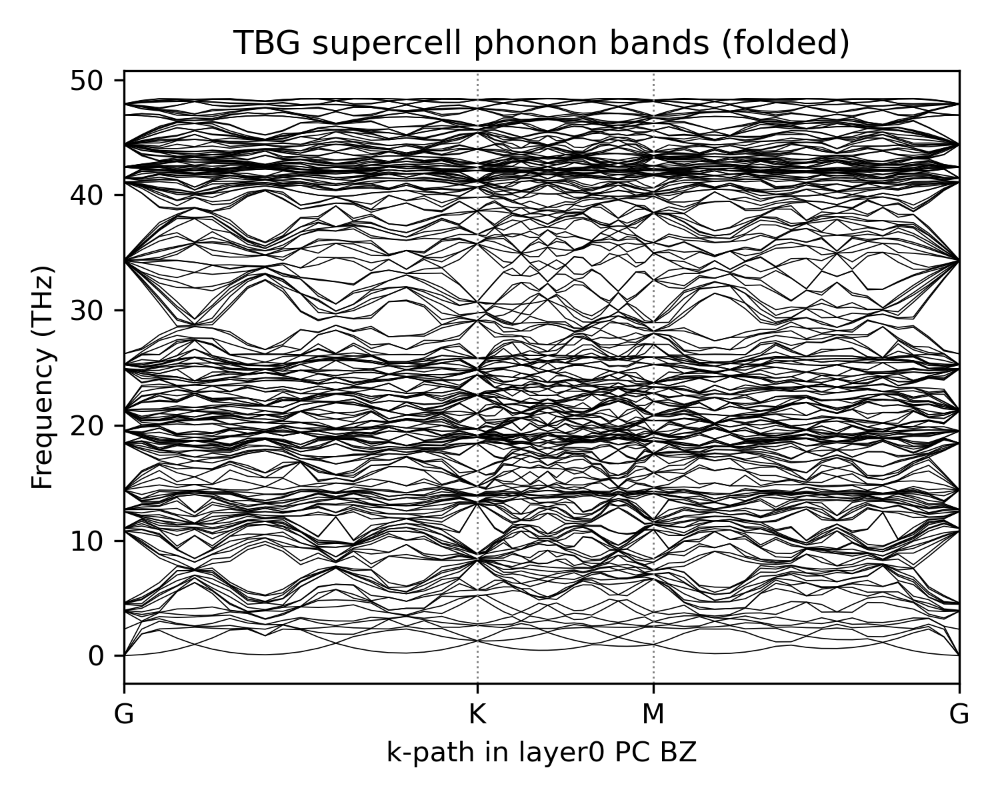
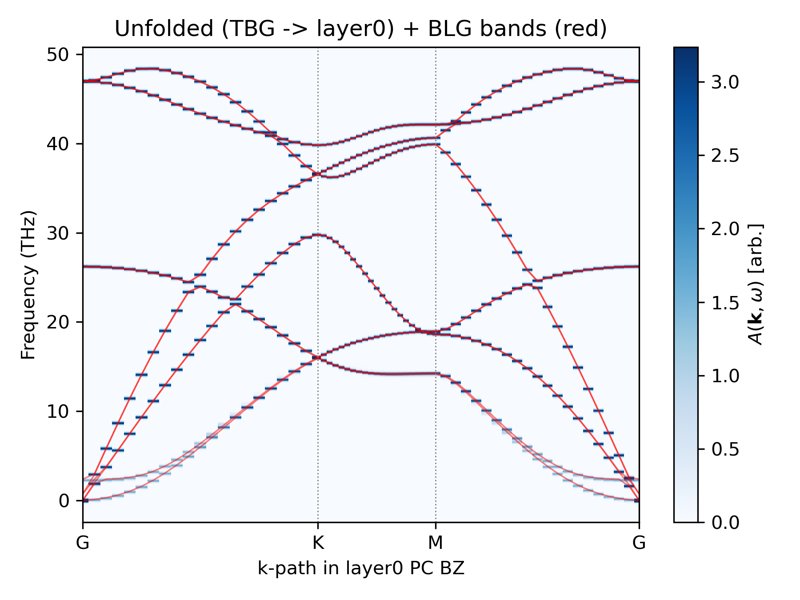

# unPHold

**unPHold** unfolds phonon band structures from a supercell calculation onto a primitive-cell Brillouin zone, and characterizes each mode.

GitHub repo: [sabia-group/unPHold](https://github.com/sabia-group/unPHold)

## What unPHold does

A supercell has a smaller Brillouin zone than the primitive cell it is built from, so its phonon branches appear as folded copies of the primitive-cell dispersion.
Unfolding reverses this down-folding: from a supercell phonon calculation it recovers the effective primitive-cell dispersion.
The [Theory](theory/unfolding.md) section explains the mathematical details.

<figure markdown>
  { width=320 }
  { width=320 }
  <figcaption>
    Twisted bilayer graphene, before and after unfolding.
    Left: the raw phonon bands of the moiré supercell, where every mode is folded into the small moiré Brillouin zone, giving dense, hard-to-read bands.
    Right: after unfolding onto one layer's primitive cell (blue), the effective dispersion is recovered and can be compared against a Bernal bilayer reference (red).
  </figcaption>
</figure>

## Scope

- 3D and 2D supercells, moiré superlattices, defected structures
- Relaxed / deregistered structures
- Phonon mode characterization

## Features

- Atom matching for defective, de-registered, and layer-resolved systems, making unPHold work with a variety of supercell types.
- Per-mode unfolding weights and easy unfolded band structure visualization.
- Mode-character metrics: acoustic participation ratio (APR), longitudinality (L), and out-of-plane verticality (V).
- Built on [phonopy](https://phonopy.github.io/phonopy/): unPHold reuses phonopy's force constants and structural metadata, so it works with any data source including DFT code and machine-learning interatomic potential (MLIP).

## Getting started

- [Installation](installation.md)
- Theory: [unfolding](theory/unfolding.md), [mode-character metrics](theory/metrics.md)
- Tutorials: [Si bulk](tutorials/si.md), [twisted bilayer graphene](tutorials/twisted_bilayer.md),
  and [defect graphene monolayer](tutorials/defect.md)
