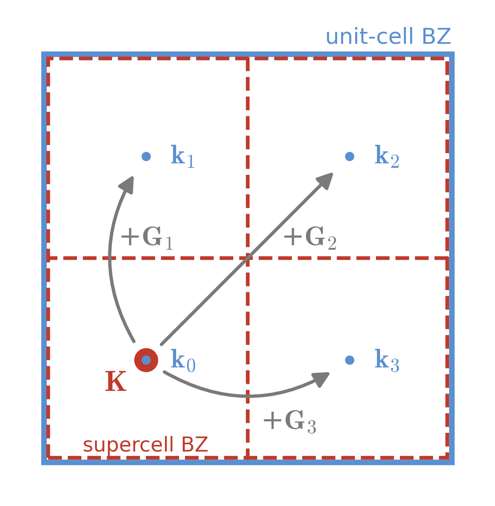

# Unfolding Theory

A supercell (SC) has a smaller Brillouin zone than the unit cell (UC) it is built from, so its phonon branches appear as folded copies of the unit-cell dispersion.
Unfolding reverses this: it recovers the effective unit-cell band structure from a supercell calculation and quantifies how much unit-cell character each supercell mode carries.

Throughout, the UC is any cell that tiles the SC through an integer transformation matrix \(\mathbf{T}\).
In most applications it is the primitive cell, but unfolding requires only commensurability, not primitivity.

## Phonons spectrum with harmonic approximation

In the harmonic approximation, the second-order force constants \(C\) define the dynamical matrix \(D(\mathbf{k})\), whose eigenproblem

\[
\sum_{\kappa'\alpha'} D_{\kappa\alpha,\kappa'\alpha'}(\mathbf{k})\, e_{\kappa'\alpha',\nu}(\mathbf{k})
= \omega_{\mathbf{k}\nu}^2\, e_{\kappa\alpha,\nu}(\mathbf{k})
\]

gives the phonon frequencies \(\omega_{\mathbf{k}\nu}\) and eigenvectors \(e_{\kappa\alpha,\nu}(\mathbf{k})\) for the mode \(\ket{\mathbf{k},\nu}\),
where \(\kappa\) indexes atoms in the cell, \(\alpha\) a Cartesian direction, and \(\nu\) the band.

`unPHold` reads harmonic phonons directly from [`phonopy`](https://phonopy.github.io/phonopy/), so the phonon calculation, as a well-established technique, is conducted by `phonopy`.

## Supercell and k-point folding

The SC is a periodic repetition of the UC, so its Brillouin zone (BZ) is smaller than that of the UC.
Transformation matrix \(\mathbf{T}\) is required to create the SC from the UC:

\[
\mathbf{T}
\begin{bmatrix}
  \mathbf{a}_1^\text{UC} \\
  \mathbf{a}_2^\text{UC} \\
  \mathbf{a}_3^\text{UC}
\end{bmatrix}
= \begin{bmatrix}
  \mathbf{a}_1^\text{SC} \\
  \mathbf{a}_2^\text{SC} \\
  \mathbf{a}_3^\text{SC}
\end{bmatrix}
\]

where \(\mathbf{a}_i^\text{UC}\) and \(\mathbf{a}_i^\text{SC}\) are the unit-cell and supercell lattice vectors (row vectors), respectively.
Correspondingly, the reciprocal lattice vectors are related by

\[
\mathbf{T}^{\mathsf{T}} \begin{bmatrix}
  \mathbf{b}_1^\text{SC} \\
  \mathbf{b}_2^\text{SC} \\
  \mathbf{b}_3^\text{SC}
\end{bmatrix}
= \begin{bmatrix}
  \mathbf{b}_1^\text{UC} \\
  \mathbf{b}_2^\text{UC} \\
  \mathbf{b}_3^\text{UC}
\end{bmatrix}
\]

Since the unit cell and the supercell share the same reciprocal space (\(\mathbf{k}^\text{UC} = \mathbf{k}^\text{SC}\)), a unit-cell k-point \(\mathbf{k}\) maps to its supercell counterpart through folding.
It is worth noting that `phonopy` uses fractional coordinates for k-points, and the fractional coordinates of the supercell k-point are related to those of the unit cell by

\[
\tilde{\mathbf{k}}^\text{SC} = \tilde{\mathbf{k}}^\text{UC} \, \mathbf{T}^\mathsf{T}
\]

where \(\tilde{\mathbf{k}}\) are the fractional coordinates (row vectors) in the BZ of SC or UC:

\[
\mathbf{k} = \tilde{\mathbf{k}}
\begin{bmatrix}
  \mathbf{b}_1 \\
  \mathbf{b}_2 \\
  \mathbf{b}_3
\end{bmatrix}
\]

The supercell contains \(N_\text{UC} = \det\mathbf{T}\) unit cells, whose lattice translations \(\mathbf{R}_p\), \(p = 1,\dots,N_\text{UC}\), generate the SC from the UC.
Folding is many-to-one: as many as \(N_\text{UC}\) UC BZ k-points with positions \(\mathbf{k} = \mathbf{K} + \mathbf{G}\) fold onto the same SC BZ k-point \(\mathbf{K}\), where \(\mathbf{G}\) runs over the supercell reciprocal lattice vectors.
Unfolding reverses this, taking the supercell modes from the SC BZ \(\mathbf{K}\) back to the UC BZ \(\mathbf{k}\)s.

<figure markdown>
  { width=340 }
  <figcaption>
  BZ folding for a 2x2 supercell in 2D.
  Unit-cell BZ is pad by 2x2 supercell BZs.
  Folding collapses the four <strong style="color:#5a8fd0">k</strong>p=0,1,2,3 onto <strong style="color:#c0392b">K</strong>;
  unfolding redistributes the supercell modes at <strong style="color:#c0392b">K</strong> back over the <strong style="color:#5a8fd0">k</strong>p=0,1,2,3.
  </figcaption>
</figure>

## Unfolding supercell modes

The unfolding weight \(w_{\mathbf{k},(\mathbf{K},\nu)}\) quantifies how much unit-cell character at \(\mathbf{k}\) a supercell mode \(\ket{\mathbf{K},\nu}\) carries, where \(\nu\) is the supercell band index and \(\kappa\), \(\alpha\) index atoms and Cartesian directions as above.
To obtain it, one projects the supercell mode \(\ket{\mathbf{K},\nu}\) onto the unit-cell phonon modes \(\ket{\mathbf{k},\mu}\) at \(\mathbf{k}\),
and the squared norm of the projection gives the weight[^allen],

\[
w_{\mathbf{k},(\mathbf{K},\nu)} = \frac{1}{N_\text{UC}} \sum_{\mu}
\left| \braket{\mathbf{k},\mu}{\mathbf{K},\nu} \right|^2 ,
\]

where \(\mu\) runs over the unit-cell bands.
A phonon mode is a displacement amplitude on each atom, so both modes are vectors of \(3\,N^\text{SC}_\text{atoms}\) components and the projection is a finite sum over supercell atoms.

In the atomic gauge used by `phonopy`, a Bloch mode at \(\mathbf{k}\) carries the phase \(e^{i\mathbf{k}\cdot\mathbf{r}}\) on the atom at position \(\mathbf{r}\).
For this special case \(\mathbf{G} = 0\) that makes \(\mathbf{k} = \mathbf{K}\), the Bloch phase factors from the supercell mode and the unit-cell mode cancel each other.
The weight is then a plain sum of eigenvector components at the same \(\mathbf{k}\),

\[
w_{\mathbf{k},\nu} = \frac{1}{N_\text{UC}} \sum_{\mu}
\left| \braket{\mathbf{k},\mu}{\mathbf{K} \equiv \mathbf{k},\nu} \right|^2
\Rightarrow \frac{1}{N_\text{UC}} \sum_{\mu}
\left| \sum_{\kappa\alpha} \left(e^\text{UC}_{\kappa\alpha,\mu}(\mathbf{k})\right)^{*}\,
\sum_{p} e^\text{SC}_{(p\kappa)\alpha,\,\nu}(\mathbf{k}) \right|^2 ,
\]

where \((p\kappa)\) is the supercell atom that is the \(p\)-th copy of unit-cell atom \(\kappa\),
and the unit-cell eigenvector \(e^\text{UC}_{\kappa\alpha,\mu}(\mathbf{k})\) is the same on every copy \(p\) (the advantage of \(\mathbf{G} = 0\)).

Looking at this equation, we find that it is a projector: it projects the supercell mode onto the subspace with zero phase factor, the patterns identical on every unit-cell copy.
The unit-cell eigenvectors form a complete orthonormal basis of that subspace,
\(\sum_{\mu} e_{\kappa\alpha,\mu}^\text{UC} \left( e_{\kappa'\alpha',\mu}^\text{UC} \right)^{*} = \delta_{\kappa\alpha,\kappa'\alpha'}\),
so the weight does not depend on them at all[^allen]:
the sum over \(\mu\) collapses, no unit-cell phonon calculation is needed, and the weight simplifies to the final working equation,

\[
w_{\mathbf{k},\nu} = \frac{1}{N_\text{UC}} \sum_{\kappa\alpha}
\left| \sum_{p} e^\text{SC}_{(p\kappa)\alpha,\,\nu}(\mathbf{k}) \right|^2 .
\]

This is the formula `unPHold` evaluates.

The weights are bounded between 0 and 1: 0 meaning the supercell mode carries no unit-cell character at \(\mathbf{k}\), and 1 meaning it is exactly a unit-cell Bloch mode at \(\mathbf{k}\).

## References

The unfolding methodology follows P. B. Allen et al.[^allen].

[^allen]: P. B. Allen, T. Berlijn, D. A. Reichman, and Z. Fang, *Recovering hidden Bloch character: Unfolding electrons, phonons, and slabs*, Phys. Rev. B **87**, 085322 (2013).
