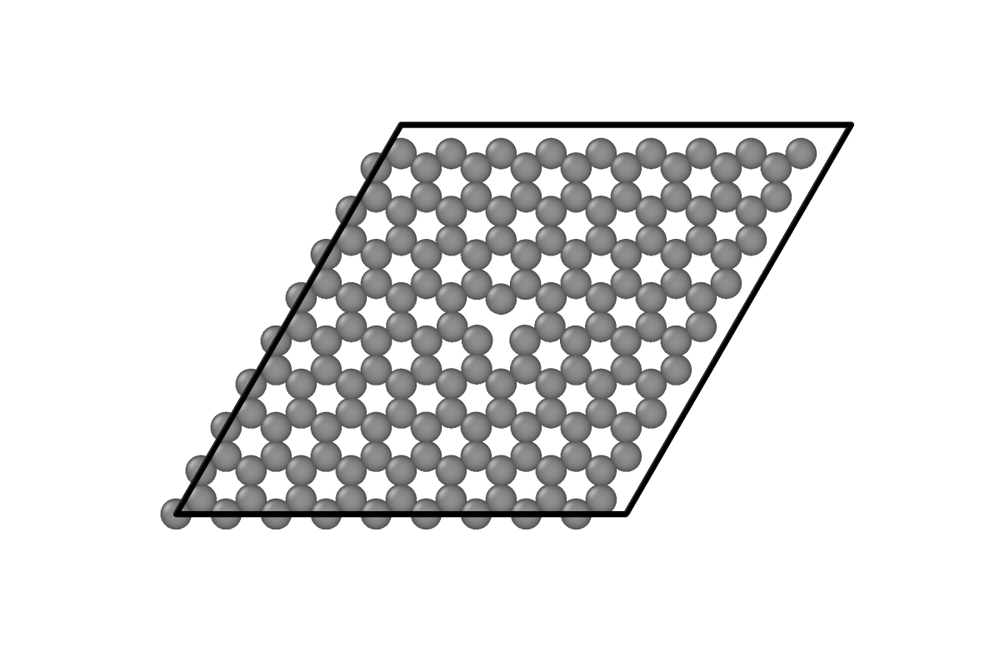
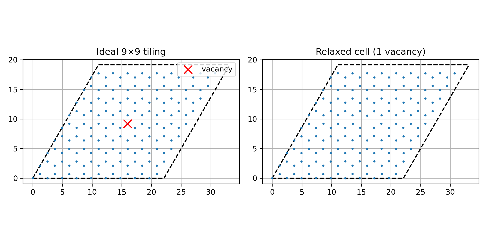
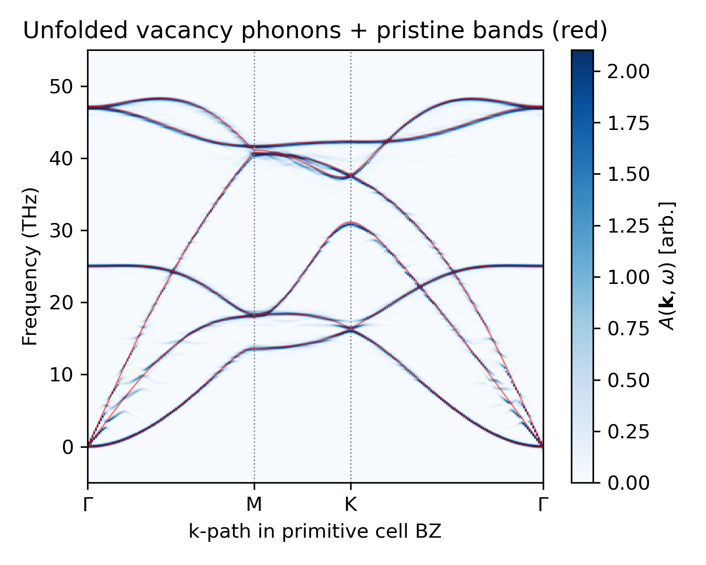

# Defect Materials: Graphene Monolayer Vacancy

In this section, we unfold the phonons of a graphene monolayer with a single vacancy back to the primitive cell.
The example script is available at [`examples/unfold_graphene_vacancy.py`](https://github.com/sabia-group/unPHold/blob/main/examples/unfold_graphene_vacancy.py).
We obtain the forces from the model [MACE-OMAT-0](https://github.com/ACEsuit/mace-foundations); data is available at [`tests/data/graphene`](https://github.com/sabia-group/unPHold/blob/main/tests/data/graphene).
The following code snippets are extracted from the example script.

<figure markdown>
  { width=320 }
  <figcaption>9x9x1 graphene monolayer with one vacancy, relaxed structure.</figcaption>
</figure>

---

## Matching the atomic structure

`Unfold` needs to know which atom of the supercell corresponds to which site of the defect-free and ideal primitive-cell tiling.
For a rigid or a weakly deregistered supercell this map is a permutation and `Unfold` finds it automatically.
With a vacancy, we build the map explicitly with the helper function [`match_atoms_with_vacancies()`][unphold.utils.match_atoms_with_vacancies].

We first construct the ideal 9x9x1 tiling from the primitive cell, then match the real defected and relaxed cell against it:

```python
sc_by_tmat = make_supercell(atoms_pc, TMAT, wrap=False)  # TMAT = diag([9, 9, 1])
match = match_atoms_with_vacancies(ideal=sc_by_tmat, real=sc_real, spatial_tolerance=0.5)
perm = match["perm_real2ideal"]  # ideal-indexed, real-valued, -1 at the vacancy
vac_ideal_idx = match["vacancy_indices"]
```

`perm` is the `perm_sc2gen` array as an `Unfold` parameter: the integer at position `i` is the index in the real cell of the atom sitting at ideal site `i`, or `-1` if that site is a vacancy.
To make this map visible, we label each ideal site on the left with its `perm_sc2gen` value,
and each atom of the real relaxed structure on the right with its own sequential index, so equal numbers identify a matched pair.

<figure markdown>
  { width=700 }
  <figcaption>Ideal 9x9 tiling with each site labelled by its perm_sc2gen value (left) and the relaxed vacancy cell with each atom labelled by its sequential index (right), viewed along the out-of-plane axis. The red cross marks the ideal site with no counterpart in the real cell, i.e. the vacancy.</figcaption>
</figure>

## Preparing inputs

We load a `Phonopy` object with its force constants for both the vacancy cell (the unfolding source) and the pristine cell (whose bands are the reference).
We read the relaxed primitive cell directly from `gp_pc.xyz`, the 2-atom cell relaxed with the same model.
This is the same cell we tiled to build the ideal reference in the matching step above.

The structure passed as `supercell` is `ph_vac.unitcell`, the true periodic cell that carries the vacancy, and the dynamical matrix comes from that same cell:

```python
unfold = Unfold(
    unitcell=atoms_pc,
    supercell=atoms_ph2ase(ph_vac.unitcell),
    transformation_matrix=TMAT,   # diag([9, 9, 1])
    perm_sc2gen=perm,
    verbose=True,
)
```

## Running the unfolding

We use the hexagonal k-path `Γ-M-K-Γ` in the primitive-cell BZ, then run the three steps for unfolding:

```python
unfold.set_kpts_in_unitcell(kpts_flat, format="fractional")
unfold.calculate_sc_phonon(dyn_sc=ph_vac.dynamical_matrix, factor="thz")
unfold.calculate_weights()
```

[`Unfold.calculate_sc_phonon()`][unphold.unfold.Unfold.calculate_sc_phonon] diagonalizes the dynamical matrix at each k-point, and [`Unfold.calculate_weights()`][unphold.unfold.Unfold.calculate_weights] projects each eigenvector onto the primitive cell, skipping the vacancy site (its `-1` entry contributes a zero vector).

## Weight conservation with a vacancy

For a perfect supercell the unfolding weights sum to \(3 N^\text{uc}_\text{atoms}\) at every k-point.
With vacancies the sum becomes

$$
\sum_n w_{\mathbf{k},n}
= \frac{3 N^\text{sc,+v}_\text{atoms}}{N_\text{uc}}
= 3 \left(N^\text{uc}_\text{atoms} - \frac{n_v}{N_\text{uc}} \right)
$$

where \(n_v\) is the number of vacancies, \(N_\text{uc} = \det(\texttt{TMAT})\) is the number of primitive cells in the tiling,
and \(N^\text{sc,+v}_\text{atoms} = N_\text{uc} N^\text{uc}_\text{atoms} - n_v\) is the number of atoms actually present in the calculated cell.
For this example (\(N^\text{uc}_\text{atoms} = 2\), \(n_v = 1\), \(N_\text{uc} = 81\)) the sum is \(3 \times 161 / 81 = 5.96296\), which is consistent with the example script output.

## Unfolded spectral function

The weights are defined mode by mode. Turning them into a spectral function applies a Gaussian broadening at each mode frequency, with a fixed width \(\sigma\) and the unfolding weight as amplitude.

$$
A(\mathbf{k}, \omega) = \sum_n w_{\mathbf{k},n}\, g(\omega - \omega_{\mathbf{k},n}, \sigma)
$$

```python
spectral, grid, sigma = unfold.calculate_spectral_function_on_grid()
```

Compared to the unfolded TBG spectral function, the vacancy cell shows many more band breaks and extra lines.
With one vacancy per 81 primitive cells the defect density is high, so a large fraction of the modes are perturbed.

<figure markdown>
  { width=460 }
  <figcaption>Unfolded spectral function of the vacancy cell (blue), with the pristine primitive-cell bands overlaid (red), along Γ-M-K-Γ.</figcaption>
</figure>

The branches are perturbed differently depending on their polarization.
The in-plane longitudinal and transverse acoustic branches (LA and TA) show band breaks and diffuse weight, while the out-of-plane acoustic and optic branches (ZA and ZO) barely change compared to the primitive cell.
Two reasons explain this:
First, the monolayer graphene with a single vacancy is still flat, so the out-of-plane motion stays decoupled from the in-plane motion (the $xz$ and $yz$ elements of the force constants are close to zero), whereas the in-plane longitudinal and transverse motions are coupled by the vacancy.
Second, most of a carbon-carbon bond's stiffness acts within the plane: displacing an atom in-plane stretches its bonds directly, while displacing it out of the plane only bends them, which costs far less energy.
Removing an atom cuts three bonds, and what disappears with them is mostly in-plane restoring force, so the vacancy is a strong scatterer for the in-plane branches but a weak one for the out-of-plane branches.
