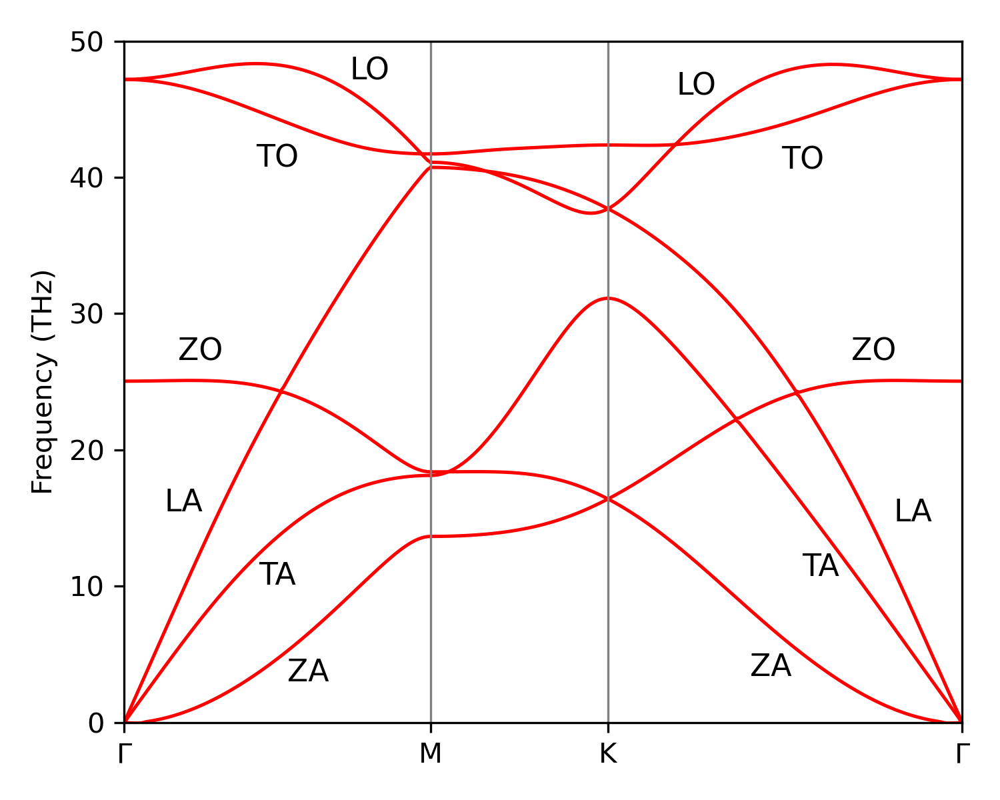
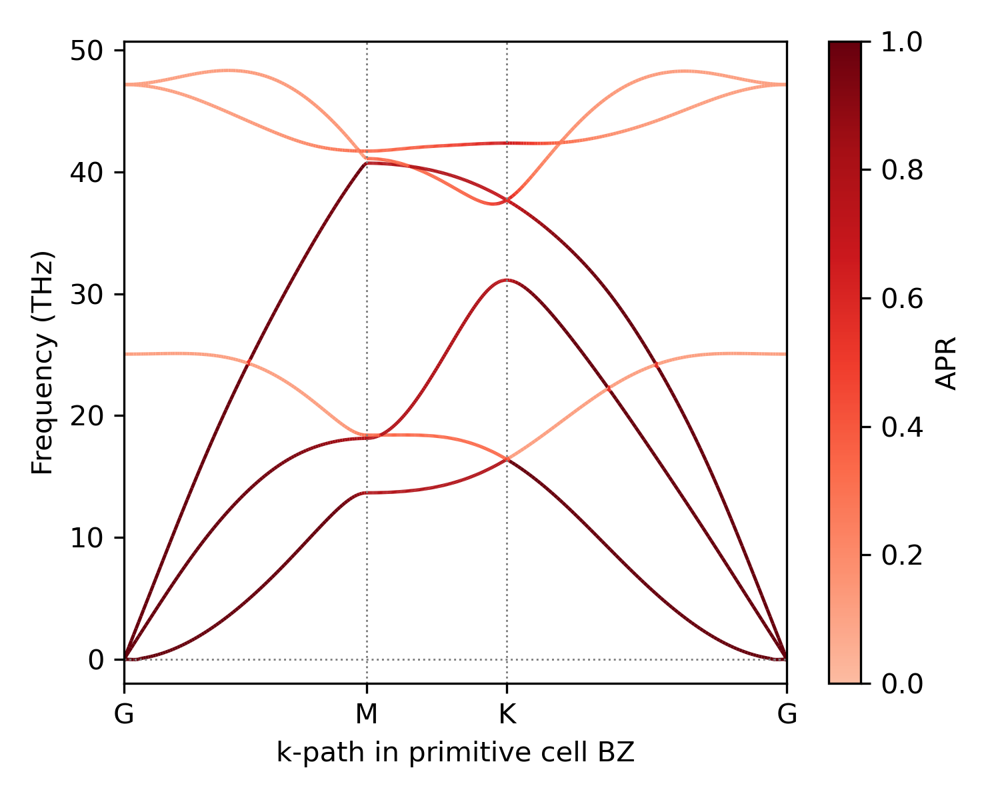
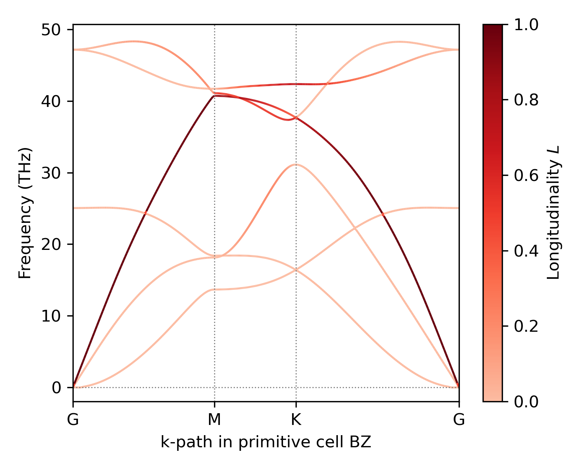
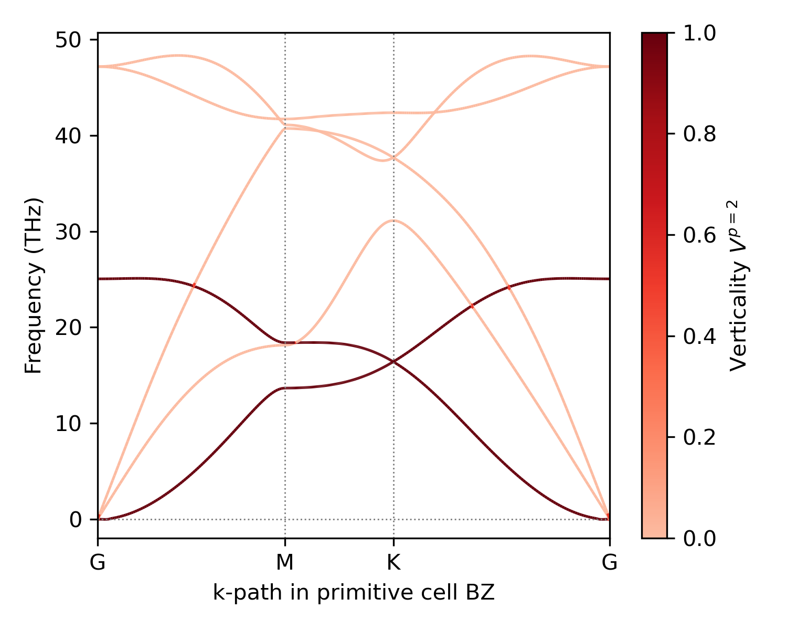

# Graphene phonon mode characterization

Different phonon mode branches have different physical character, which can be quantified by metrics computed from the phonon eigenvectors.
In this section, we compute the three mode character metrics (see [Metrics for mode characterization](../theory/metrics.md)) on monolayer graphene, and plot the band structure colored by each metric.

<figure markdown>
  { width=350 }
  <figcaption>Monolayer graphene phonon bands with branch names.</figcaption>
</figure>

The full script is available at [`examples/metrics_graphene.py`](https://github.com/sabia-group/unPHold/blob/main/examples/metrics_graphene.py).
The forces are obtained from model [MACE-OMAT-0](https://github.com/ACEsuit/mace-foundations), and data is available at [`tests/data/graphene`](https://github.com/sabia-group/unPHold/blob/main/tests/data/graphene).
The following code snippets are extracted from the full script.

Note that no unfolding is involved here: the metrics are functions of the phonon eigenvectors of any cell, so we work directly with the 2-atom primitive cell.
For an application where the metrics are combined with unfolding weights, see the [twisted bilayer graphene tutorial](twisted_bilayer.md).

---

## Preparing inputs

The metrics need phonon eigenvectors, so the band structure must be run with `with_eigenvectors=True`:

```python
ph.run_band_structure(kpts, path_connections=connections, with_eigenvectors=True)
bs = ph._band_structure
```

We use the k-path `Γ-M-K-Γ` in the hexagonal Brillouin zone (BZ).
All metric functions accept eigenvectors of shape `(nqpoints, natoms*3, nbands)` and return values between 0 and 1 for each mode and shape `(nqpoints, nbands)`.
The `*_from_phonopy` convenience wrappers loop over the k-path segments of a `Phonopy` object and return one such array per segment:

```python
apr = compute_APR_from_phonopy(ph)
lgt = compute_L_from_phonopy(ph)
v = compute_V_from_phonopy(ph)
```

In the figures below, each band is drawn as a line colored by the metric value of that mode, using a single-color colormap from light red (0) to dark red (1).

## Acoustic participation ratio

[`compute_APR`][unphold.metrics.compute_APR] quantifies how in-phase the atomic displacements of a mode are.
The three branches that emerge from zero frequency at Γ carry APR close to 1 along the path, while the optical branches show markedly lower APR, with intermediate values on some segments between M and K.

<figure markdown>
  { width=450 }
  <figcaption>Graphene phonon bands colored by the acoustic participation ratio.</figcaption>
</figure>

## Longitudinality

[`compute_L`][unphold.metrics.compute_L] measures the alignment of the displacements with the propagation direction.
At Γ itself the propagation direction is undefined and L is evaluated as 0.
The longitudinal acoustic (LA) branch stands out with L close to 1 along the path, while the other branches show much lower values, with intermediate L on parts of the optical branches.

<figure markdown>
  { width=450 }
  <figcaption>Graphene phonon bands colored by the longitudinality.</figcaption>
</figure>

## Verticality

[`compute_V`][unphold.metrics.compute_V] measures the out-of-plane (here, z) share of the displacements.
At every q-point exactly two of the six modes have V close to 1: the out-of-plane acoustic (ZA) and out-of-plane optical (ZO) branches.
All other branches are close to 0.

<figure markdown>
  { width=450 }
  <figcaption>Graphene phonon bands colored by the verticality (p=2 form).</figcaption>
</figure>
