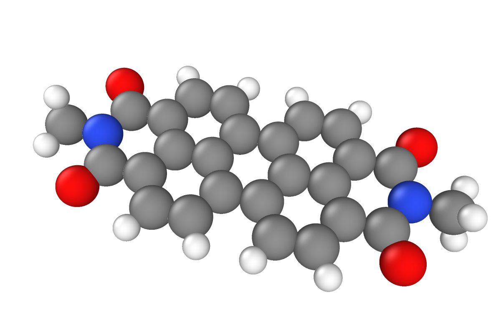
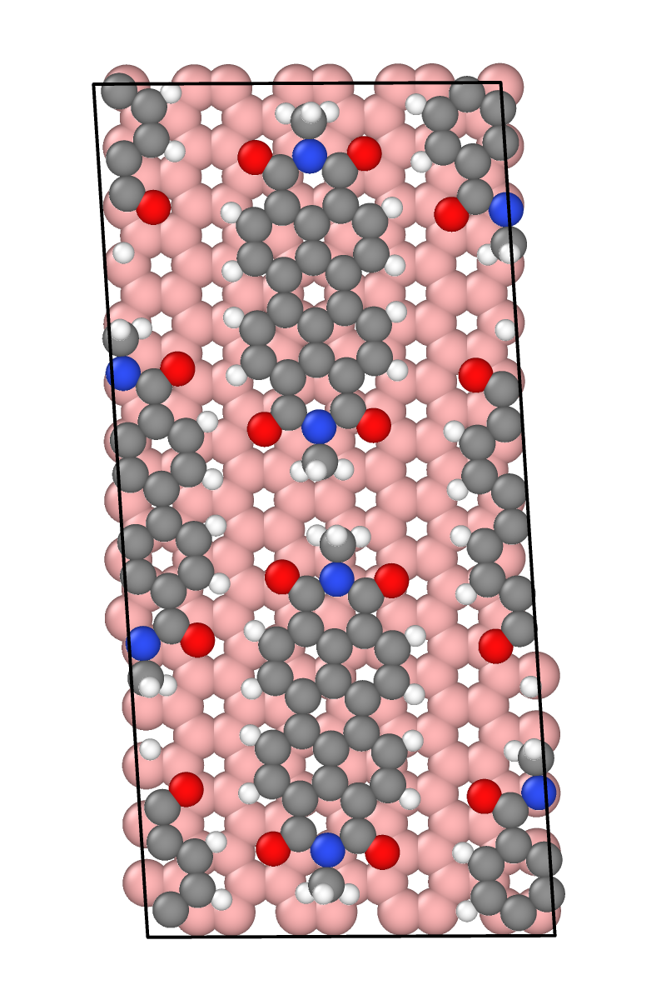
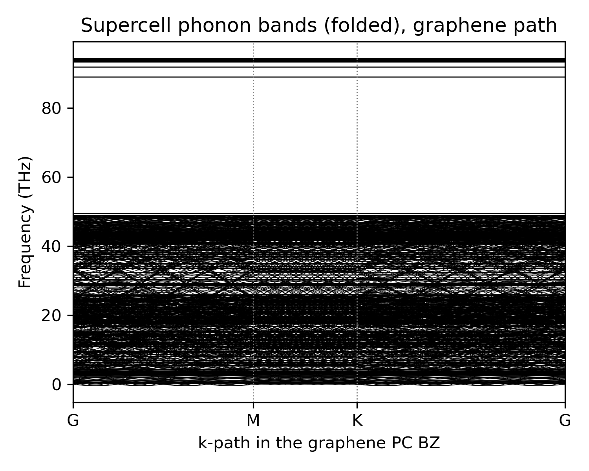
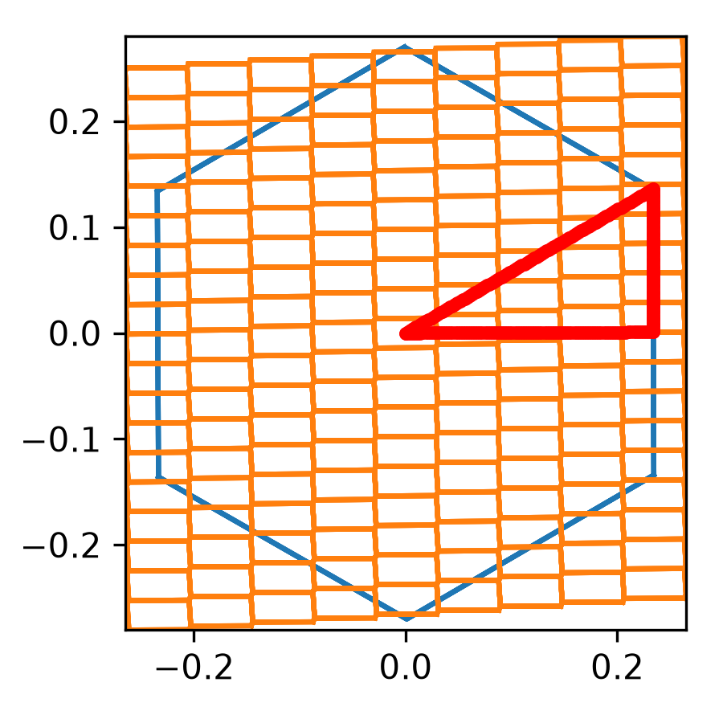
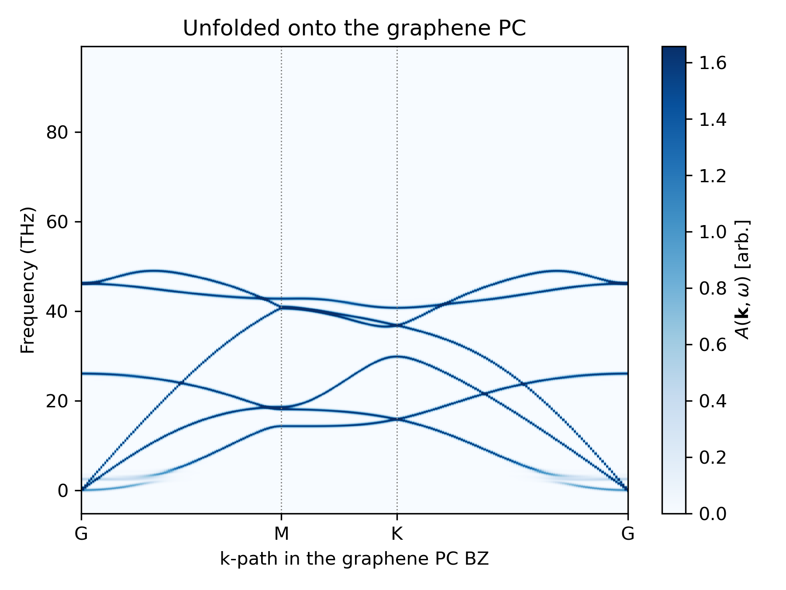
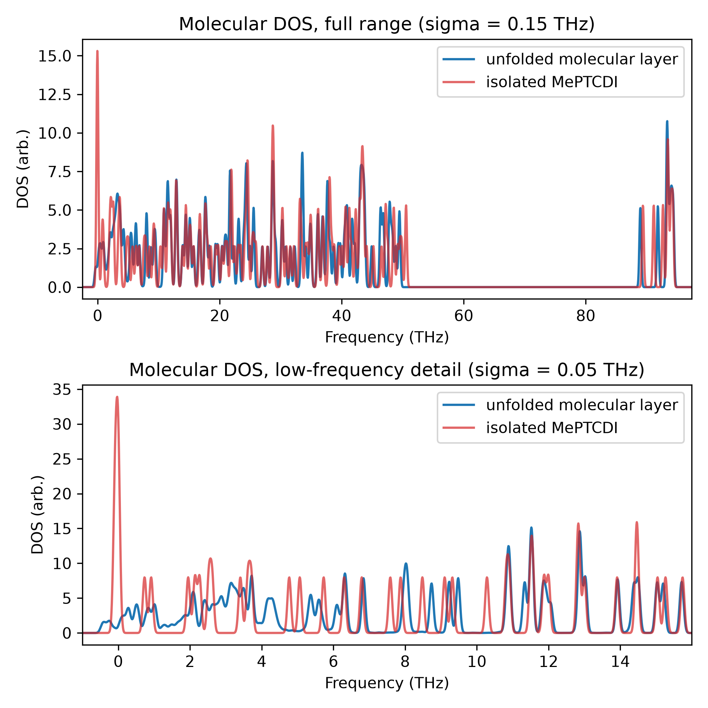
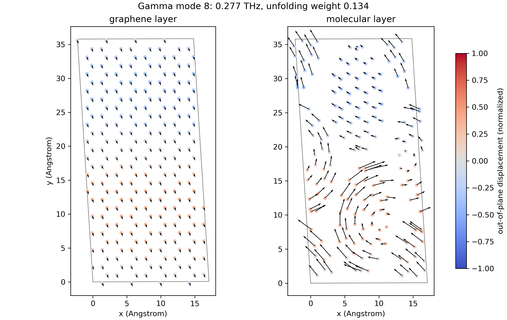
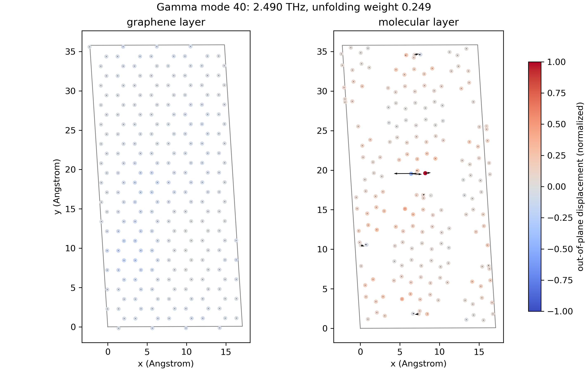
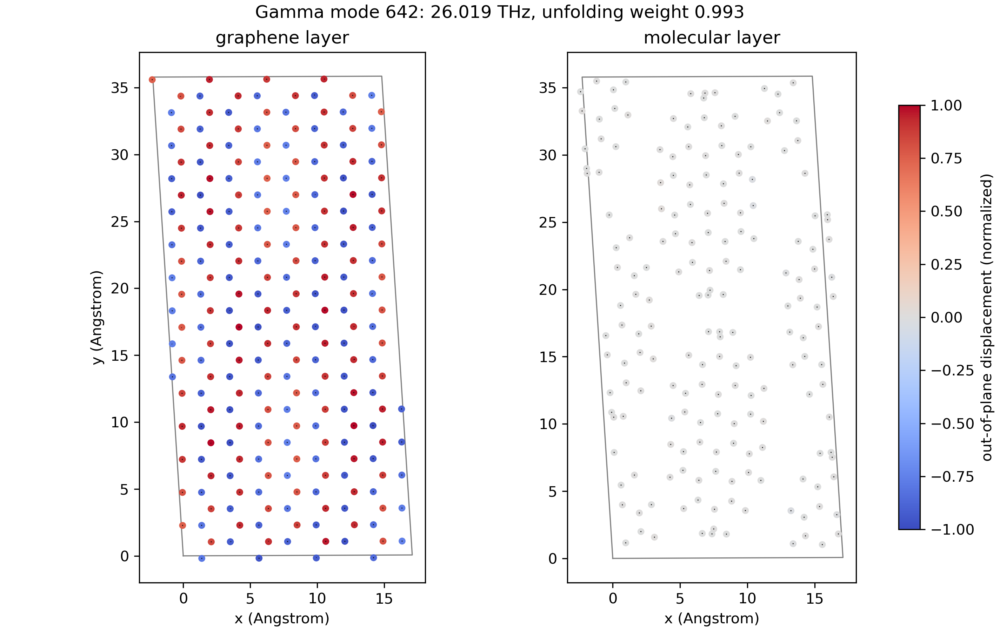

# Heterostructure: molecular array on graphene

In this section, we unfold the phonons of a molecular array on top of a graphene monolayer, a kind of heterostructure known as "mol2Dmat".
The structure (generated by [GenSec](https://github.com/sabia-group/gensec)) is a commensurate cell containing a graphene substrate and four MePTCDI (N,N'-dimethylperylene-3,4,9,10-tetracarboxylic diimide) molecules on top.
[MACE-MH-1](https://github.com/ACEsuit/mace-foundations) with D3 dispersion is used to relax the structure and construct the force constants (configurations available at [`tests/data/mol2dmat`](https://github.com/sabia-group/unPHold/blob/main/tests/data/mol2dmat)).
The full script is available at [`examples/unfold_mol2dmat.py`](https://github.com/sabia-group/unPHold/blob/main/examples/unfold_mol2dmat.py), with some snippets from it shown below.

<figure markdown>
  { width=300 }
  { width=250 }
  <figcaption>Left: the isolated MePTCDI molecule (C gray, N blue, O red, H white).
  Right: top view of the relaxed unit cell, with the graphene layer underneath drawn in pink and the four molecules on top.</figcaption>
</figure>

The heterostructure is described by one large unit cell (UC) shared between the two subparts, which have different periodicities.
The two transformation matrices are

$$
\mathbf{T}_\mathrm{graphene}
=\begin{bmatrix}
8 & -4 & 0 \\
-1 & 15 & 0 \\
0 & 0 & 1
\end{bmatrix},
\qquad
\mathbf{T}_\mathrm{mol}
=\begin{bmatrix} 2 & -1 & 0 \\
0 & 2 & 0 \\
0 & 0 & 1
\end{bmatrix}.
$$

A phonon calculation on this unit cell (UC) gives 1248 bands entangled together.
We unfold the same UC phonons twice, once onto each of the two sublattice primitive cells (PCs): graphene and the molecular layer.
Please note that, in what follows, "supercell" (SC) always refers to the ideal cell built by tiling a PC with a transformation matrix.

<figure markdown>
  { width=420 }
  <figcaption>
  Phonon bands of the unit cell, plotted along the graphene primitive-cell k-path.
  The small imaginary frequencies could be suppressed by using a larger supercell for the force-constants calculation (currently 3x3x1).
  </figcaption>
</figure>


---

## Graphene primitive cell

The relaxed lattice is slightly sheared away from the ideal hexagonal lattice due to the molecular array, so instead of starting from an ideal graphene primitive cell we derive the PC directly from the UC, $\mathbf{a}^\mathrm{PC} = \mathbf{T}^{-1}_\mathrm{graphene}\, \mathbf{a}^\mathrm{UC}$, and place the two carbon atoms at the $1/3$ fractional sites:

```python
pc_cell = numpy.linalg.solve(TMAT_GRAPHENE, atoms_sc.cell.array)
```

We then obtain the nuclei index mapping `perm_sc2gen` between the real (relaxed) atoms and the rigid (ideal) generated cell via [`match_two_2d_atoms_pbc_with_2d_frac_shift`][unphold.utils.match_two_2d_atoms_pbc_with_2d_frac_shift].
Next, we pick the standard Γ-M-K-Γ path in the graphene PC Brillouin zone (BZ).
Since the UC is large, its BZ is a small tile repeated many times to cover the graphene PC BZ:

<figure markdown>
  { width=250 }
  <figcaption>Graphene PC BZ (blue) with the repeated UC BZ (orange) and the Γ-M-K-Γ path (red).</figcaption>
</figure>

## Unfolding onto the graphene lattice

With the PC, the transformation matrix, and `perm_sc2gen` in hand, the unfolding itself is straightforward:

```python
unfold = Unfold(
    unitcell=atoms_pc,
    supercell=atoms_sc,
    transformation_matrix=TMAT_GRAPHENE,
    perm_sc2gen=perm,
)
unfold.set_kpts_in_unitcell(kpts_flat, format="fractional")
unfold.calculate_sc_phonon(dyn_sc=ph.dynamical_matrix, factor="thz")
unfold.calculate_weights()
```

In the `Unfold` call the UC is passed as the `supercell` argument, since from the PC's point of view the calculated cell is its supercell.
Then [`Unfold.calculate_sc_phonon()`][unphold.unfold.Unfold.calculate_sc_phonon] diagonalizes the UC dynamical matrix at each k-point, and [`Unfold.calculate_weights()`][unphold.unfold.Unfold.calculate_weights] projects each eigenvector onto the primitive-cell space.
The unfolded phonon spectral function is obtained by adding a Gaussian broadening with weights as amplitudes:

<figure markdown>
  { width=480 }
  <figcaption>Unfolded spectral function on the graphene PC BZ path.</figcaption>
</figure>

This recovers the graphene phonon dispersion as clear branches, with the molecular covalent modes above 80 THz removed. It is worth noting that the spectral function below 10 THz is blurred, indicating strong coupling between the graphene and molecular phonon modes; a layer-breathing mode appears at 2.5 THz and is visualized below.


## Molecular primitive cell

The four molecules in the cell are not identical copies of one another: after relaxation each molecule is rotated in-plane by a slightly different angle, and two of them are cut by the periodic boundary.
The script handles this in three steps:

1. **Find and unwrap the molecules.**
    Atoms of the molecular layer are grouped into four clusters, one per molecule, using `ase.neighborlist`. Each cluster is then made contiguous in real space.
2. **Find the nuclei index mapping for each molecule.**
    We rotate the isolated reference MePTCDI molecule to match the approximate in-plane orientation of each molecule in the unit cell, then carefully match nuclei indices for each molecule, species by species, to avoid mismatching a -CH3 group that might rotate. The reference molecule rotated onto the first molecule also defines the molecular primitive cell.
3. **Construct the full index mapping.**
    We tile the molecular primitive cell with $\mathbf{T}_\mathrm{mol}$ to build the ideal molecular supercell, assign each generated copy to the relaxed molecule closest to it by center of mass, and combine this with the per-molecule nuclei mappings to construct the full index mapping for the molecular layer, known as `perm_sc2gen`, used for unfolding.

## Unfolding onto the molecular lattice

Unfolding on a uniform k-mesh in the molecular BZ and averaging over k gives the vibrational density of states (VDOS) of the molecular layer, shown here against the isolated MePTCDI spectrum.
The VDOS below 10 THz is quite different, indicating coupling between the molecular and graphene layers.

<figure markdown>
  { width=560 }
  <figcaption>Unfolded DOS of the molecular layer (blue) against the isolated MePTCDI spectrum (red), full range (top) and low-frequency detail (bottom).</figcaption>
</figure>

## Visualizing Γ-point modes

We can further visualize the real-space motion of the coupled heterostructure.
Here we plot some of those Γ-point modes, with phonon frequency and unfolding weight on graphene labeled in the figures.
To obtain the figures, run the following command:

```bash
python examples/unfold_mol2dmat.py --viz-idx 8 40 642
```

<figure markdown>
  { width=700 }
  <figcaption>Mode 8 (0.277 THz, weight 0.134). The graphene layer exhibits a ZA motion along the y-direction, while the molecules exhibit a curling in-plane motion and an out-of-plane displacement pattern similar to graphene's.</figcaption>
</figure>

<figure markdown>
  { width=700 }
  <figcaption>Mode 40 (2.490 THz, weight 0.249). This is the layer-breathing-mode-like phonon of this heterostructure: the collective motion is dominant along the z-direction, and the two layers move against each other.</figcaption>
</figure>

<figure markdown>
  { width=700 }
  <figcaption>Mode 642 (26.019 THz, weight 0.993). This is the graphene ZO mode, and it hardly couples with the molecular layer.</figcaption>
</figure>
