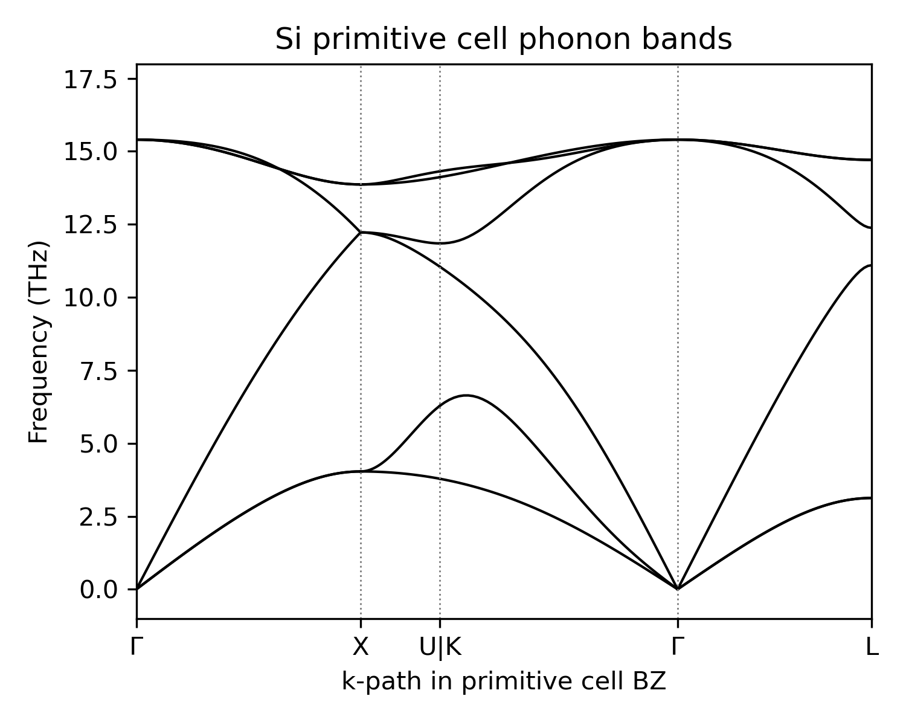
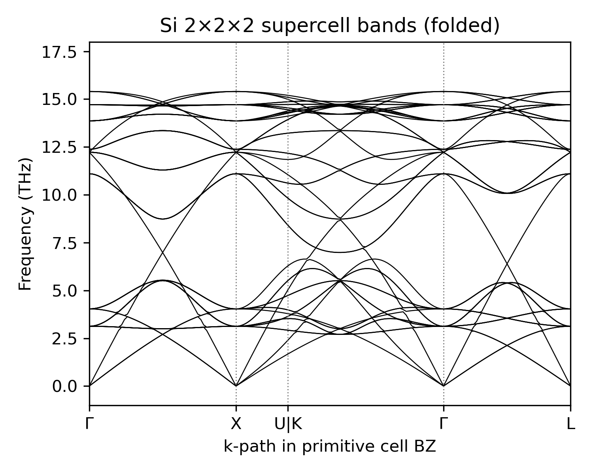
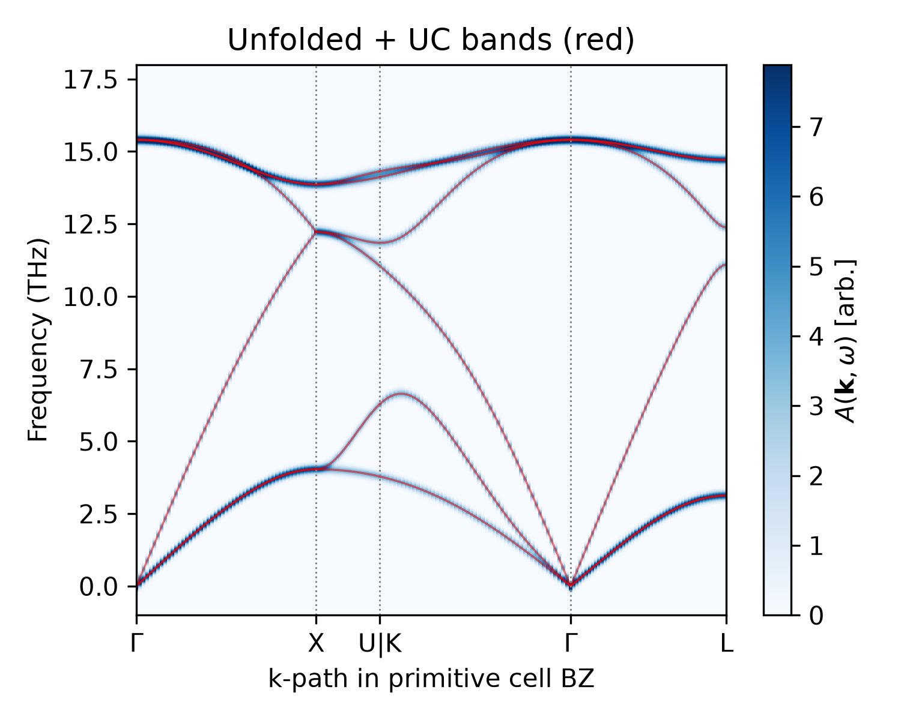
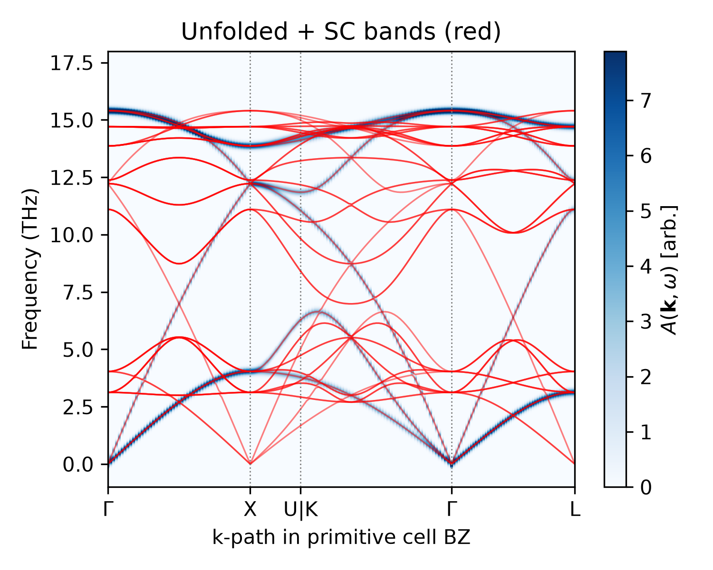

# Si: 3D Bulk Unfolding

In this section, we demonstrate how to unfold silicon phonon bands from a 2x2x2 supercell back to the primitive cell.
The full script is available at [`examples/si_bulk_unfolding.py`](https://github.com/sabia-group/unPHold/blob/main/examples/si_bulk_unfolding.py).
The following code snippets are extracted from the full script.

<figure markdown>
  { width=300 }
  <figcaption>Si unit cell (left) and primitive cell (right). Image: <a href="https://vasp.at/tutorials/latest/bulk/part1/">VASP tutorials</a>.</figcaption>
</figure>

---

## Preparing inputs

unPHold only needs `Phonopy` object of the supercell (usually reload from a `phonopy.yaml` file) with its force constants as input.
One can refer to [this tutorial](https://how-tos.readthedocs.io/en/latest/phonopy_simple/phonopy_in_python.html) for a complete phonopy workflow in Python.

We have prepared the 2x2x2 supercell data (`tests/data/si/uc_2_sc_1_aims/`) for unfolding, as well as the primitive cell data (`tests/data/si/uc_1_sc_2_aims/`) for reference.
Since their respective supercells for constructing force constants by finite difference are the same, the unfolded supercell phonon bands should match the primitive cell bands exactly.

We can load above data and plot the phonon bands for both the primitive cell and the supercell:

<figure markdown>
  { width=300 }
  { width=300 }
  <figcaption>Left: Si primitive-cell phonon bands, calculated with 2x2x2 supercell. Right: Si 2x2x2 supercell bands plotted in the primitive-cell BZ.</figcaption>
</figure>

### K-point path

The standard high-symmetry points for FCC are:

<figure markdown>
  { width=300 }
  <figcaption>FCC Brillouin zone with standard high-symmetry points. Image: <a href="https://fhi-aims-club.gitlab.io/tutorials/phonons-with-fhi-vibes/phonons/2_phonopy_basics/exercise-2/">FHI-vibes tutorial</a>.</figcaption>
</figure>

We use the k-path `Γ-X-U|K-Γ-L` in primitive cell BZ.
A supercell built by repeating the primitive cell is described by an integer transformation matrix `TMAT`, where `supercell_vectors = TMAT @ unitcell_vectors`.
For our 2x2x2 supercell, `TMAT = diag([2, 2, 2])`.
This same matrix maps a k-point's fractional coordinates from the primitive-cell BZ to the (larger) supercell BZ, which is what lets us evaluate the supercell phonons at the k-points we actually care about:

```python
kpts_uc, connections = get_band_qpoints_and_path_connections(KPATH, npoints=51)
kpts_flat, bz_idx = concatenate_bands(kpts_uc, connections)
kpts_sc = [k @ TMAT.T for k in kpts_uc]
```

`kpts_flat` has shape `(nkpts, 3)`: `Unfold` consumes a single flat array of k-points rather than phonopy's per-segment path format, since it evaluates every k-point independently.
`kpts_uc` and `connections` are kept around to recover high-symmetry tick marks and reformat the unfolding output into the standard phonopy band format for plotting; see the full script for details.

### Running the unfolding

```python
unfold = Unfold(
    unitcell=atoms_ph2ase(ph_uc.unitcell),
    supercell=atoms_ph2ase(ph_sc.unitcell),
    transformation_matrix=TMAT,
    verbose=True,
)
unfold.set_kpts_in_unitcell(kpts_flat, format="fractional")
unfold.calculate_sc_phonon(dyn_sc=ph_sc.dynamical_matrix, factor="thz")
unfold.calculate_weights()
```

[`Unfold.calculate_sc_phonon()`][unphold.unfold.Unfold.calculate_sc_phonon] diagonalises the supercell dynamical matrix at each k-point.
[`Unfold.calculate_weights()`][unphold.unfold.Unfold.calculate_weights] projects each SC eigenvector onto the primitive-cell plane waves, yielding `unfold.weights` of shape `(nkpts, n_sc_modes)`.

### Validating unfolded phonon bands

To validate the unfolding weights, we can apply Gaussian expansion to the unfolded weights in the frequency axis and plot the unfolded spectral function:

```python
unfold.calculate_spectral_function_on_grid()
```

The `unfold.spectral_function_on_grid` unfolded spectral function recovers the primitive-cell dispersion, and actually filters the supercell bands:

<figure markdown>
  { width=300 }
  { width=300 }
  <figcaption>Comparing unfolded spectrum with primitive cell phonon bands (left) supercell phonon bands (right).</figcaption>
</figure>

The unfolded spectral function overlaps exactly with the primitive-cell bands (left) while picking out only a subset of the folded supercell bands (right): a supercell calculation folds all primitive-cell bands on top of each other in a smaller Brillouin zone, and unfolding undoes this, recovering the primitive-cell dispersion directly from the supercell calculation with no information lost.

This Si example is a proof of concept: primitive and supercell here come from the same finite-difference calculation, so the match is exact by construction.
The same machinery extends to genuinely new physics: twisted bilayers with no shared periodicity, de-registered (relaxed) twisted structures, and defect-containing supercells, where unfolding becomes essential to recover any meaningful band structure.
