# Twisted Bilayer Graphene: 2D Layer Unfolding

In this section, we unfold the phonon bands of a relaxed twisted bilayer graphene (TBG) structure onto a graphene primitive cell (PC).
The following code snippets are extracted from the full script available at [`examples/unfold_tbg.py`](https://github.com/sabia-group/unPHold/blob/main/examples/unfold_tbg.py).
The forces are obtained by a MACE model, with data available at [`tests/data/tbg`](https://github.com/sabia-group/unPHold/blob/main/tests/data/tbg).

<figure markdown>
  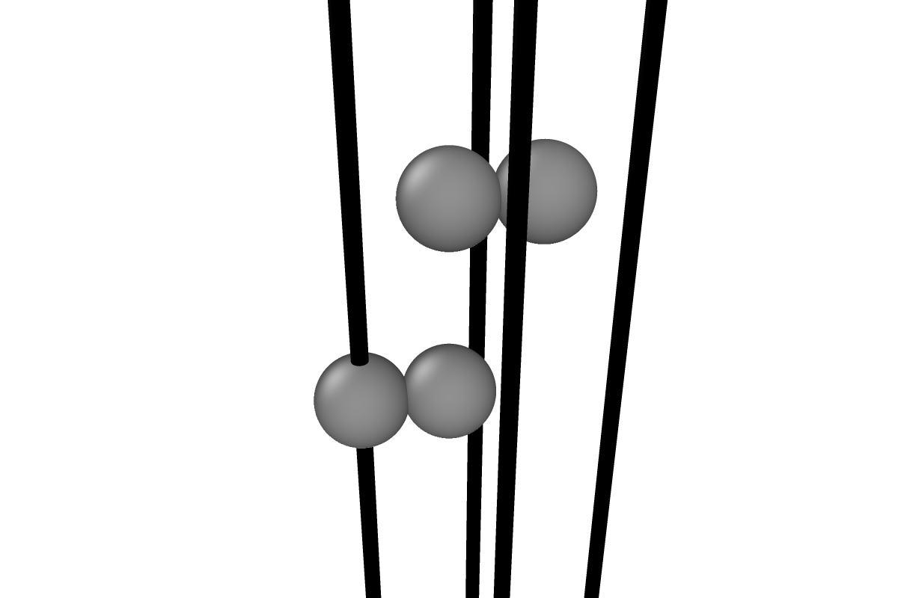{ width=220 }
  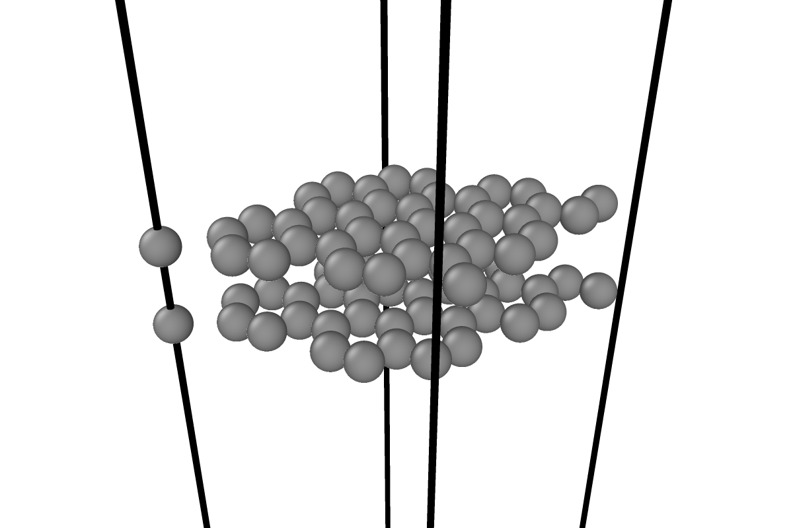{ width=340 }
  <figcaption>Left: Bernal (AB-stacked) bilayer graphene (BLG) primitive cell, 4 atoms.
  Right: a 76-atom TBG moiré supercell (twist angle 13.17&deg;), built by rotating one layer relative
  to the other and finding a commensurate cell. Visualization by OVITO.</figcaption>
</figure>

Twisting one layer relative to the other produces a moiré pattern, and the two layers' Brillouin zones (BZ) no longer point in the same direction, so the moiré cell only has one, much smaller, mini-BZ.
A phonon calculation on this cell folds every mode into the mini-BZ and gives dense bands.
Since the two layers don't share a common PC BZ, we unfold onto one layer's PC BZ instead: this recovers the bilayer's actual band structure (TBG is still a bilayer, coupling and all), plotted in a BZ where we can characterize the bands (acoustic vs. optical, which layer a mode lives on).

We also compute Bernal-stacked bilayer graphene (BLG) phonons as a reference, since its bands are simple and well understood, and use them to check the unfolded TBG spectrum against.
In particular, BLG's layer-breathing mode (LBM, the two layers rigidly moving in opposite directions out-of-plane) is a clean, single mode we can look for once we unfold the more complicated TBG case.

For generating twisted bilayer structures, see [this tutorial](https://how-tos.readthedocs.io/en/latest/twist_bilayer/twist_bilayer.html).

**Naming convention used in this tutorial**: PC is the monolayer graphene primitive cell; SC is one layer's supercell, either the ideal, rigid version built by tiling the PC with a transformation matrix, or the real, relaxed layer sliced directly out of the TBG structure, depending on context; UC is the actual TBG structure (both layers, relaxed).

---

## Preparing inputs

`unPHold` only needs a `Phonopy` object with force constants, the PC we are going to unfold onto (here `atoms_gp_pc`), and the transformation matrix connecting the two:

```python
ph_tbg = load(tbg_dir)
atoms_gp_pc = read(tbg_dir / "gp_pc.xyz")  # 2-atom monolayer graphene primitive cell
tmat_l0 = numpy.load(tbg_dir / "tmat.npz")["tmat_l0"]
```

`tmat_l0` is the transformation matrix for building a rigid SC that matches the bottom layer (`l0`) of the TBG UC:

$$
\mathbf{T} = \begin{bmatrix}
  2 & 3 & 0 \\
  -3 & 5 & 0 \\
  0 & 0 & 1
\end{bmatrix}
$$

We also load the Bernal-stacked reference structure:

```python
ph_blg = load(blg_dir)
```

## Aligning the primitive cell orientation and Brillouin zone

When the TBG structure was built, its lattice vector 0 was intentionally aligned to the x-axis; the PC we load has no reason to follow that same orientation.
So `tmat_l0 @ PC` builds an SC with the right shape, but generally the wrong orientation, rotated relative to the actual TBG bottom layer (l0).
[`calculate_pc_rotation_angle()`][unphold.utils.calculate_pc_rotation_angle] finds the PC rotation that corrects this:

```python
ret = calculate_pc_rotation_angle(atoms_gp_pc, tmat_l0)
atoms_pc_rot = ret["atoms_pc_rot"]
```

<figure markdown>
  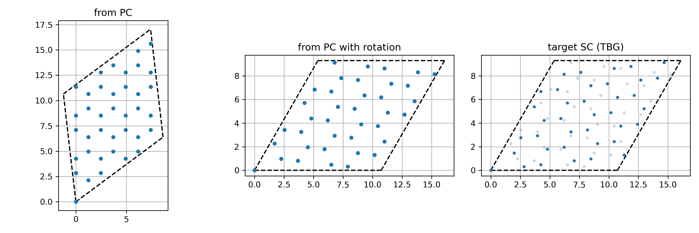{ width=700 }
  <figcaption>
    Left: SC generated from the original PC, not aligned with the target.
    Middle: SC generated from the rotated PC, now aligned.
    Right: the target TBG bottom layer (shallow blue), for comparison, in the same orientation as the middle panel.
  </figcaption>
</figure>

Rotating the PC also rotates its BZ, so this same step aligns the PC's BZ with the moiré SC's mini-BZ.
[`visualize_BZ_2d`][unphold.visualize.visualize_BZ_2d] and [`visualize_kpath_2d`][unphold.visualize.visualize_kpath_2d] let us check this directly, and pick a k-path in the PC BZ:

<figure markdown>
  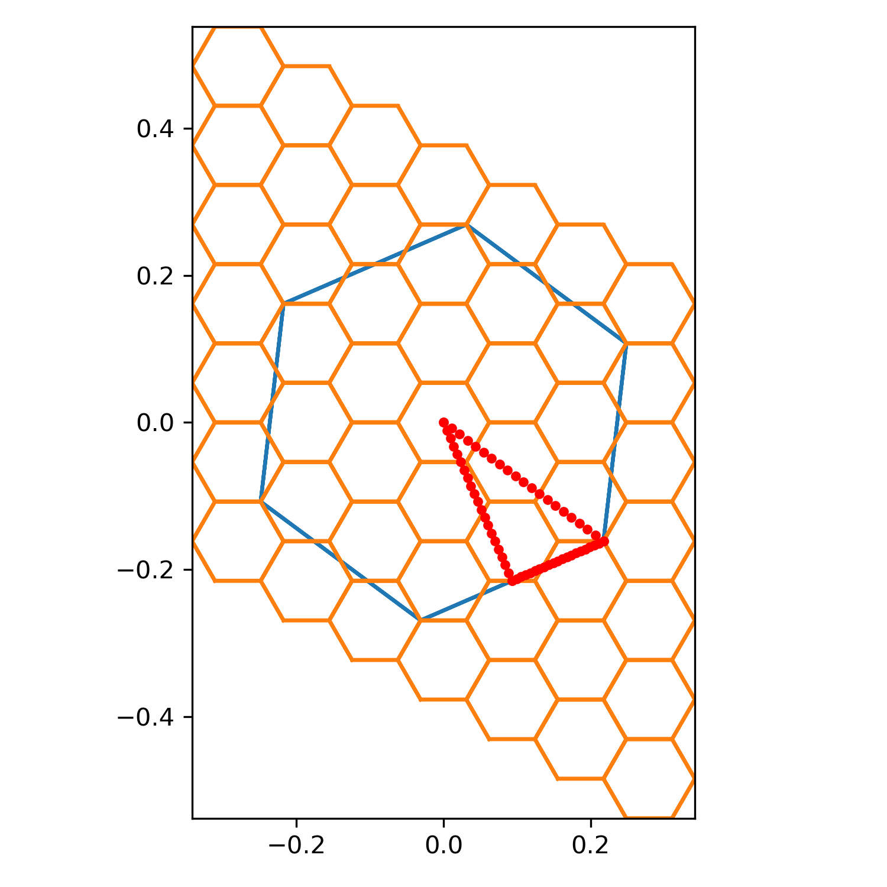{ width=320 }
  <figcaption>
    Moiré SC BZ (orange, repeated) with the PC BZ (blue) and Γ-K-M-Γ path (red) overlaid.
  </figcaption>
</figure>

We compare the BLG reference bands against the raw (folded) TBG phonon bands on the same k-path in PC BZ:

<figure markdown>
  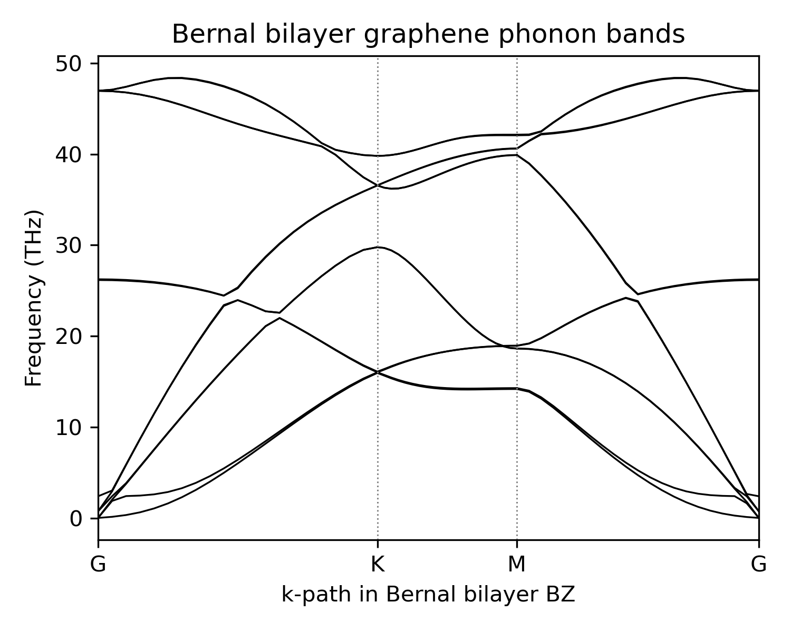{ width=320 }
  { width=320 }
  <figcaption>
    Left: Bernal-stacked bilayer graphene phonon bands.
    Right: raw phonon bands of the target TBG, plotted on the bottom layer PC BZ k-path, folded into a dense mesh by the moiré periodicity.
  </figcaption>
</figure>

## Matching atomic indices

`Unfold` also needs to know which TBG atoms correspond to which atoms in the ideal, rigid SC built from the rotated PC.
This mapping is the `perm_sc2gen` array passed to `Unfold` (**perm**utation from input **s**uper**c**ell to **gen**erated supercell).
We build it in two steps: slice out layer 0 by z-coordinate, then match it against the ideal SC with [`match_two_2d_atoms_pbc_with_2d_frac_shift`][unphold.utils.match_two_2d_atoms_pbc_with_2d_frac_shift], which searches over small in-plane shifts to tolerate the rigid misalignment between the two:

```python
layer0_indices = numpy.where(atoms_tbg_uc.positions[:, 2] < z_mean)[0]
atoms_layer0 = atoms_tbg_uc[layer0_indices]
match_result = match_two_2d_atoms_pbc_with_2d_frac_shift(
    atoms_layer0, sc_from_pc_rot, spatial_tolerance=1.0, ignore_z=False, ...
)
perm_sc2gen_l0 = layer0_indices[match_result["atoms_indices_a2b"]]
```

<figure markdown>
  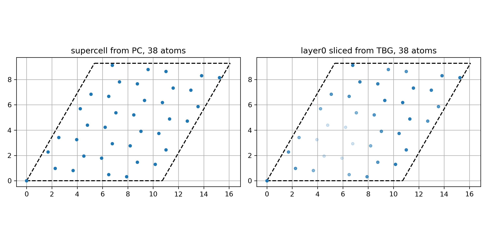{ width=700 }
  <figcaption>
    The ideal SC generated from the rotated PC (left) side by side with layer 0 sliced directly out of the real, relaxed moiré structure (right).
    Lighter atoms in the right panel are at AA-stacking regions, where the interlayer distance is larger.
  </figcaption>
</figure>

## Unfolded spectral function

With `perm_sc2gen_l0` in hand, we have everything needed to unfold the TBG bottom layer onto its PC:

```python
unfold = Unfold(
    unitcell=atoms_pc_rot,
    supercell=atoms_tbg_uc,
    transformation_matrix=tmat_l0,
    perm_sc2gen=perm_sc2gen_l0,
)
```

The k-path setup and the `calculate_*` sequence are identical to the [Si tutorial](si.md):
`kpts_uc_flat` is the flat array of k-points along the Γ-K-M-Γ path chosen above, in the layer-0 PC BZ.

```python
unfold.set_kpts_in_unitcell(kpts_uc_flat, format="fractional")
unfold.calculate_sc_phonon(dyn_sc=ph_tbg.dynamical_matrix, factor="thz")
unfold.calculate_weights()
unfold.calculate_spectral_function_on_grid()
```

We plot the broadened spectral function from the unfolding weights against the BLG reference bands:

<figure markdown>
  { width=320 }
  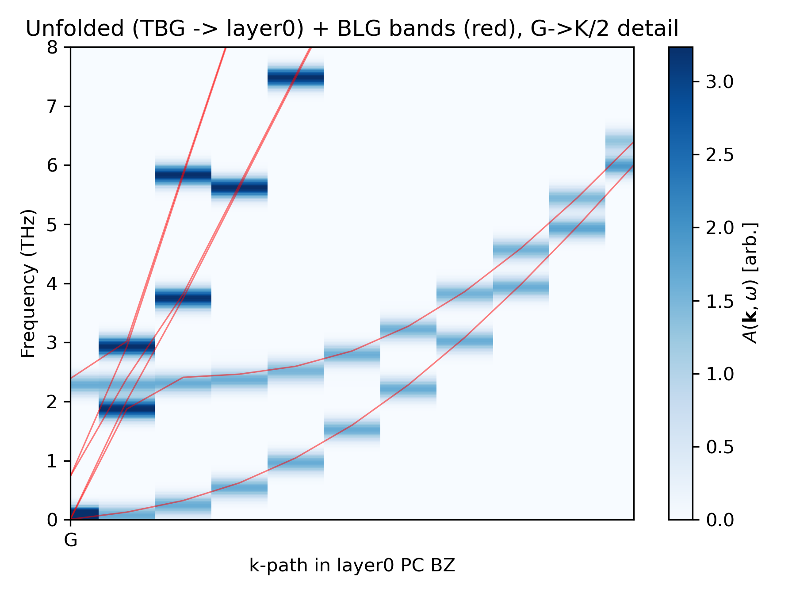{ width=320 }
  <figcaption>
    Left: unfolded TBG spectral function (blue) with Bernal bilayer bands overlaid (red).
    Right: low-energy detail near Γ of the left figure.
  </figcaption>
</figure>

The unfolded TBG spectrum matches the Bernal bilayer results.
Near Γ we also see the flat, non-dispersive LBM around 2.3 THz; we identify and visualize it next.

## Identifying and visualizing the breathing mode in TBG

`unfold.calculate_sc_phonon` already diagonalizes the full moiré SC at every k-point on the path, including Γ, so `unfold.bs_sc_eigenvecs[0]` / `unfold.bs_sc_energies[0]` give the exact Γ-point eigenmodes directly, with no extra calculation needed.
We scan them for modes that are optical (low [`compute_APR`][unphold.metrics.compute_APR]), strongly out-of-plane (high [`compute_V`][unphold.metrics.compute_V]), and carry non-negligible layer-0 weight, in the frequency window suggested by the plot above (see the [graphene metrics tutorial](metrics.md) for an introduction to these metrics):

```python
cand_mask = (gamma_freqs > 2.0) & (gamma_freqs < 2.6) & (gamma_weights > 0.01)
apr = compute_APR(atoms=unfold.sc, ph_eigvecs=cand_eigvecs)
v = compute_V(atoms=unfold.sc, ph_eigvecs=cand_eigvecs)
```

For this TBG (twist angle 13.17°), this turns up a single, solid candidate:

| band | freq (THz) | APR    | V      | weight |
|-----:|-----------:|-------:|-------:|-------:|
|    5 |     2.2820 | 0.0002 | 1.0000 | 0.4995 |

APR ≈ 0 confirms it is optical (the LBM belongs to the anti-symmetric ZO branch); V = 1 confirms the displacement is almost purely out-of-plane.
The weight is ≈ 0.5 because a purely out-of-plane, unit-normalized eigenvector splits its weight between the two layers in proportion to how many atoms each one has, and here half the atoms are in the bottom layer.

[`plot_layer_mode_2d`][unphold.visualize.plot_layer_mode_2d] visualizes the real-space displacement of this LBM:

<figure markdown>
  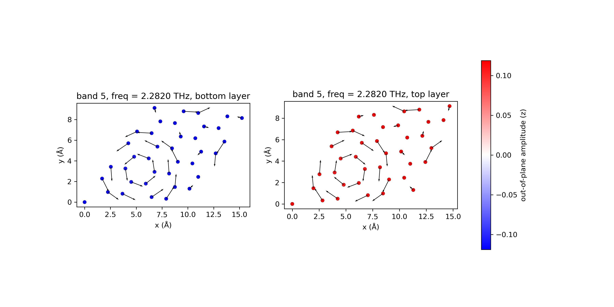{ width=700 }
  <figcaption>
    Band 5 at Γ (2.28 THz): the bottom layer (left) moves uniformly in -z (blue), the top layer (right) uniformly in +z (red); the in-plane component (arrows) is small.
  </figcaption>
</figure>

---

## LBM splitting in a larger moiré cell

The same workflow applies unchanged to a larger, more strongly coupled moiré cell (data at `tests/data/tbg/m_6_r_1_sc_1_mace`, twist angle 5.09°, 508 atoms):

<figure markdown>
  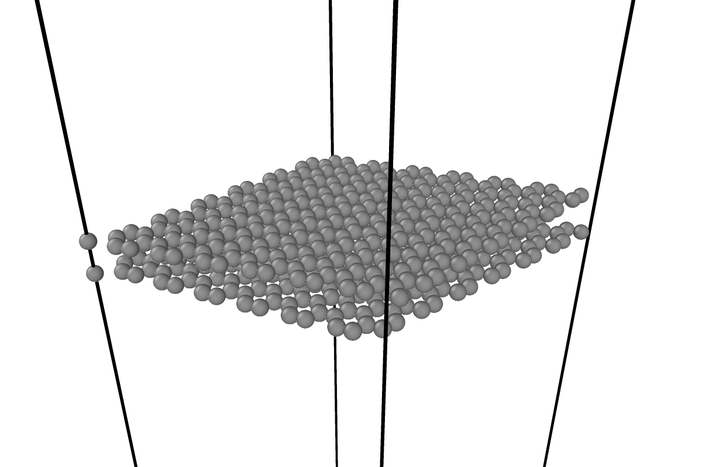{ width=340 }
  <figcaption>The TBG with twist angle 5.09&deg;.</figcaption>
</figure>

The same 2.0–2.6 THz candidate search now turns up two modes instead of one:

| band | freq (THz) | APR    | V      | weight |
|-----:|-----------:|-------:|-------:|-------:|
|   17 |     2.2822 | 0.0000 | 0.9992 | 0.4197 |
|   24 |     2.3899 | 0.0000 | 0.9999 | 0.0799 |

Both are still optical and almost purely out-of-plane, and their weights still add up to ≈ 0.5, so the LBM has split into two modes rather than disappeared.
With the larger moiré cell, the breathing amplitude is no longer spatially uniform but modulated over the moiré pattern itself:

<figure markdown>
  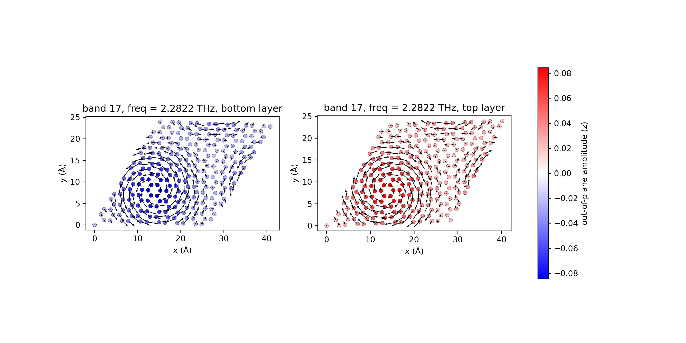{ width=700 }
  <figcaption>Band 17 (2.28 THz, weight 0.42): the dominant breathing mode, still antiphase between layers,
  but now peaked around one moiré stacking region and decaying towards the cell edges.</figcaption>
</figure>

<figure markdown>
  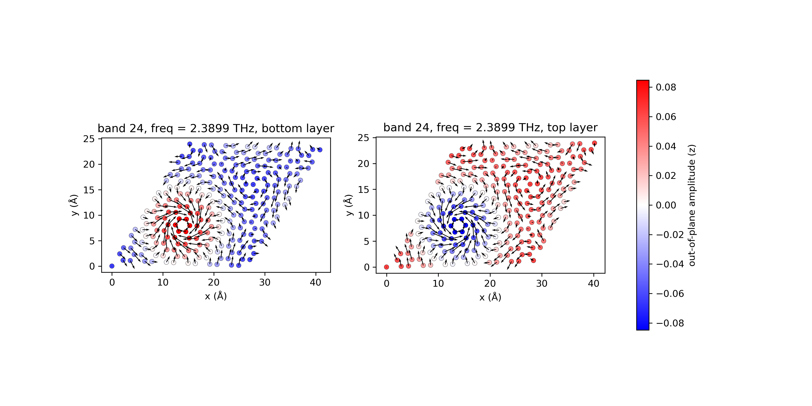{ width=700 }
  <figcaption>Band 24 (2.39 THz, weight 0.08): a secondary, lower-weight mode with a nodal structure
  across the moiré cell, a higher moiré-scale "harmonic" of the same interlayer motion.</figcaption>
</figure>

The moiré periodicity introduces spatially varying interlayer coupling, which reshapes the breathing mode's amplitude pattern: in band 17 the amplitude is largest at the AA-stacking region, while in band 24 the amplitude has opposite sign in different parts of the layer.
